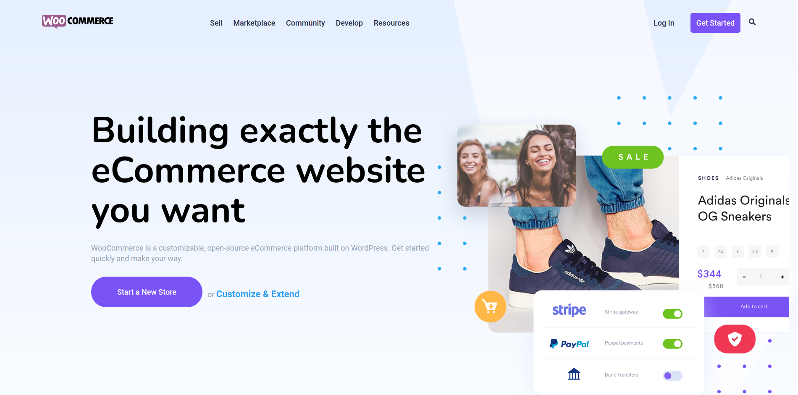

# woocommercepage

This is a landing page based on a design I found online for a woo-commerce page (credits to Pablo at https://dribbble.com/pabloixx) who gave this free of charge to practice with.

The main goal of this is to practice SCSS

You can ignore the skeleton HTML, that is just for now for the time being in order to store some html as I work the project section by section.

note: this is a DESKTOP ONLY version.

Example

